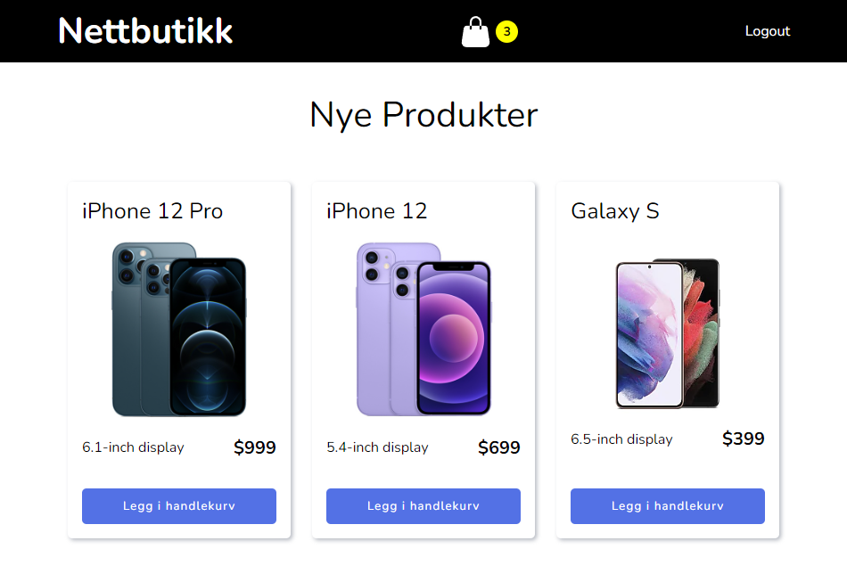

# Nettbutikk

Velkommen til nettbutikken! Dette prosjektet er et eksempel på en e-handelsløsning hvor brukere kan utforske produkter og legge dem til og fjerne de fra handlekurven. Med funksjoner for brukerregistrering og innlogging, samt sanntidsoppdateringer av handlekurven, gir denne applikasjonen en sømløs handleopplevelse. Nettbutikken er bygget med en moderne teknologistack som inkluderer React for frontend og Express med MongoDB for backend.

## Funksjonalitet

- **Produktvisning**: Utforsk produkter.
- **Handlekurv**: Legg til og fjern produkter fra handlekurven din, med automatisk oppdatering av totalsum.
- **Brukerregistrering og innlogging**
- **Backend-tilkobling**: Backend-tjenesten håndterer dataoppbevaring og autentisering via MongoDB.

## Teknologier

### Frontend
- **React**: For bygging av brukergrensesnittet.
- **Redux Toolkit**: For effektiv state management.
- **React Router**: For navigering mellom ulike sider.
- **Styled Components**: For stilsetting av komponenter.
- **Axios**: For API-kall til backend.

### Backend
- **Express**: Webapplikasjonsrammeverk for Node.js.
- **Mongoose**: For å håndtere databasetilkoblinger og modeller.
- **JWT**: For sikker autentisering og autorisasjon.
- **Bcrypt**: For sikker lagring av passord.
- **Dotenv**: For håndtering av miljøvariabler.

## Miljøvariabler

For å kjøre backend-tjenesten din, må du opprette en `.env`-fil med følgende innhold i backend mappen:
PORT=5000
DB_URI = din MongoDB-database URI og 
JWT_SECRET_KEY = din hemmelige nøkkel for JWT-signering.

## Skjermbilder av appen

